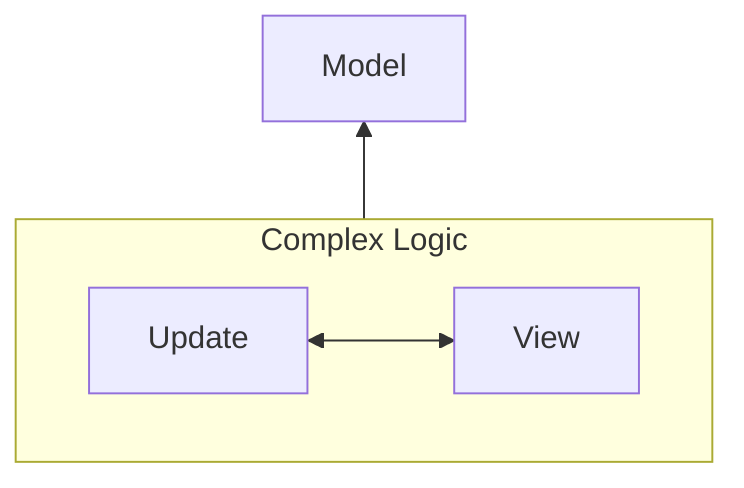
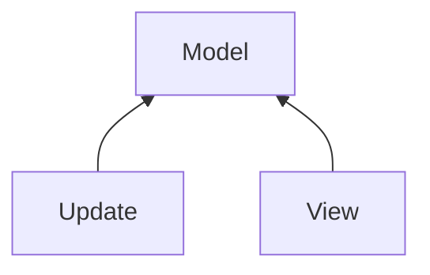
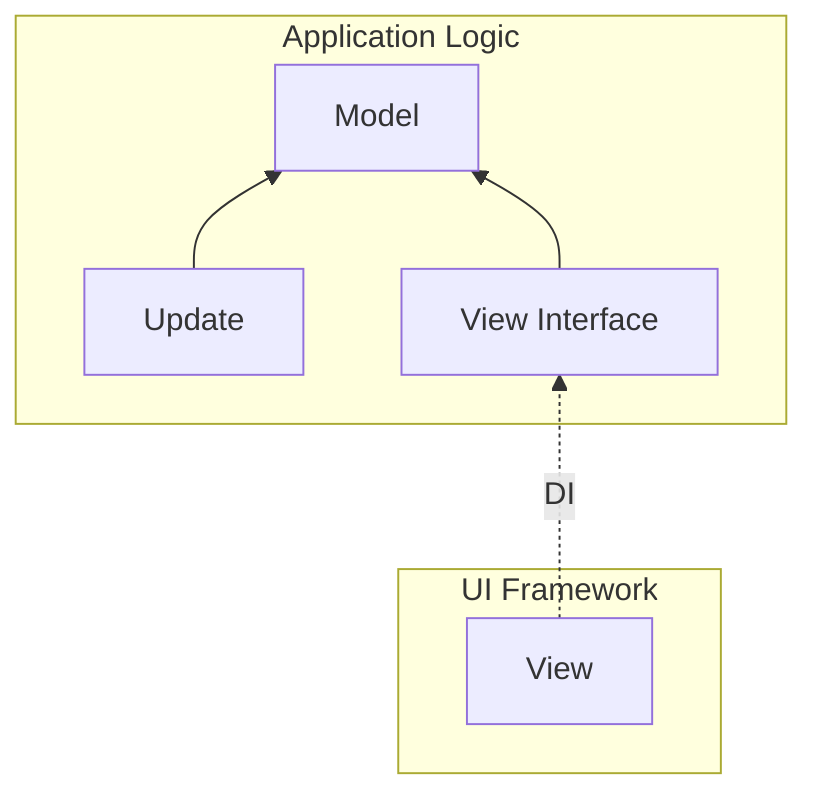

# @ichi-h/elmish

[](./LICENSE) [](https://www.npmjs.com/package/@ichi-h/elmish)

@ichi-h/elmishは、Elm Architectureのインターフェースを極力保ちつつ、UIフレームワークやUIライブラリに依存せずに状態管理を行うためのライブラリです。

## WARNING

**このライブラリは仮説検証を目的に作られているため、非常に実験的です。本番環境での使用は強く推奨しません。**

## Usage

### Install

```bash
npm install @ichi-h/elmish
```

### Define renderer

View関数が返した要素をブラウザにレンダリングする関数を定義します。

#### In Vanilla TypeScript

```typescript
export const renderer = (html: HTMLElement) => {
  document.getElementById("app")!.replaceWith(html);
};
```

#### In React

```tsx
import React from "react";
import ReactDOM from "react-dom/client";

const root = ReactDOM.createRoot(document.getElementById("root")!);

export const renderer = (html: React.ReactElement) => {
  root.render(<React.StrictMode>{html}</React.StrictMode>);
};
```

#### In Vue

```typescript
import { VNode, createApp } from "vue";

let app = createApp({});

export const renderer = (html: VNode) => {
  if (app._container) app.unmount();
  app = createApp(html);
  app.mount("#app");
};
```

[#write-logic]: write-logic

### Write logic

```typescript
// data.ts
import { elmish } from "@ichi-h/elmish";

import { renderer } from "./renderer";

// 使用しているUIライブラリに合わせてHtmlの型を変更してください。
// 以下はHTMLElementを使用した例です。
type Html = HTMLElement;

export type Model = {
  count: number;
  loader: "idle" | "loading";
};

export type Message =
  | { type: "increment" }
  | { type: "decrement" }
  | { type: "startReset" }
  | { type: "endReset" };

export const init: Model = {
  count: 0,
  loader: "idle",
} as const;

export const { useElement, send } = elmish<Model, Message, Html>(renderer);
```

```typescript
// update.ts
import { Update } from "@ichi-h/elmish";

import { Model, Message } from "./data";

export const update: Update<Model, Message> = (model, message) => {
  switch (message.type) {
    case "increment": {
      return { ...model, count: model.count + 1 };
    }

    case "decrement": {
      return { ...model, count: model.count - 1 };
    }

    case "startReset": {
      return [
        { ...model, loader: "loading" },
        async () => {
          return new Promise((resolve) => {
            setTimeout(() => {
              resolve({ type: "endReset" });
            }, 1000);
          });
        },
      ];
    }

    case "endReset": {
      return { ...model, count: 0, loader: "idle" };
    }
  }
};
```

[#use-in-vanilla-typescript]: use-in-vanilla-typescript

### Use in Vanilla TypeScript

```typescript
import { init, send, useElement } from "./data";
import { update } from "./update";

useElement(init, update, ({ model }) => {
  const app = document.createElement("div");
  app.id = "app";

  const incrementBtn = document.createElement("button");
  incrementBtn.id = "increment";
  incrementBtn.type = "button";
  incrementBtn.innerText = "+";
  incrementBtn.addEventListener("click", () => send({ type: "increment" }));

  const decrementBtn = document.createElement("button");
  decrementBtn.id = "decrement";
  decrementBtn.type = "button";
  decrementBtn.innerText = "-";
  decrementBtn.addEventListener("click", () => send({ type: "decrement" }));

  const resetBtn = document.createElement("button");
  resetBtn.id = "reset";
  resetBtn.type = "button";
  resetBtn.innerText = "reset";
  resetBtn.addEventListener("click", () => send({ type: "startReset" }));

  const counter = document.createElement("p");
  counter.id = "counter";
  counter.classList.add("read-the-docs");
  if (model.loader === "loading") {
    counter.innerText = "loading...";
  } else {
    counter.innerText = `count is ${model.count}`;
  }

  app.appendChild(decrementBtn);
  app.appendChild(resetBtn);
  app.appendChild(incrementBtn);
  app.appendChild(counter);

  return app;
});
```

[#use-in-react]: use-in-react

### Use in React

```tsx
import { init, useElement, send } from "./data";
import { update } from "./update";

useElement(init, update, ({ model }) => {
  const increment = () => send({ type: "increment" });
  const decrement = () => send({ type: "decrement" });
  const reset = () => send({ type: "startReset" });

  return (
    <div>
      <button onClick={decrement}>-</button>
      <button onClick={reset}>reset</button>
      <button onClick={increment}>+</button>
      {model.loader === "loading" && <p>loading...</p>}
      {model.loader === "idle" && <p>count is {model.count}</p>}
    </div>
  );
});
```

[#use-in-vue]: use-in-vue

### Use in Vue

```vue
<script setup lang="ts">
import { Model, send } from "./data";

defineProps<{
  model: Model;
}>();

const msg = "Vite + Vue";

const increment = () => send({ type: "increment" });

const decrement = () => send({ type: "decrement" });

const reset = () => send({ type: "startReset" });
</script>

<template>
  <button type="button" @click="decrement">-</button>
  <button type="button" @click="reset">reset</button>
  <button type="button" @click="increment">+</button>
  <p v-if="model.loader === 'loading'">loading...</p>
  <p v-else-if="model.loader === 'idle'">count is {{ model.count }}</p>
</template>
```

```typescript
import { h } from "vue";

import App from "./App.vue";
import { init, useElement } from "./data";
import { update } from "./update";

useElement(init, update, ({ model }) => h(App, { model }));
```

## Elm Architectureとは？

Elm Architectureとは、Elm言語で採用されているWebアプリケーションを構築するためのアーキテクチャです。Elmの思想は様々なフレームワークに影響を与えており、もはやElm ArchitectureはWebフロントエンドに限らず、デスクトップアプリ、モバイルアプリ、ゲームといった、対話を必要とする様々なアプリケーションのアーキテクチャとして採用されています。

私が説明するのもなんですので、Elm Architectureの概要をドキュメントを引用してみましょう。

> 
>
> Elm が画面に表示するためのHTMLを出力し、コンピュータは画面の中で起きたこと、例えば「ボタンがクリックされたよ！」というようなメッセージを Elm へ送り返します。
>
> さて、Elm プログラムの中では何が起きているのでしょうか？ Elm では、プログラムは必ず3つのパーツに分解できます。
>
> - **Model** — アプリケーションの状態
> - **View** — 状態を HTML に変換する方法
> - **Update** — メッセージを使って状態を更新する方法
>
> この3つのコンセプトこそ、**The Elm Architecture** の核心なのです。
>
> \- [The Elm Architecture · An Introduction to Elm](https://guide.elm-lang.jp/architecture/)

詳しくは [Elm言語のガイド](https://guide.elm-lang.jp/) を参照してください。

## このライブラリの目的

@ichi-h/elmishの究極の目標は、 **Viewの依存性逆転によるUIライブラリのプラグイン化の検証** です。

突然ですが、宣言的UIとは、端的に言えば **状態を更新すれば、DOMを触るといった手続き的な操作を考えずとも、自動的にUIを更新してくれるコンセプト** を指します。このコンセプトは **状態を更新するロジックと、UIを更新するロジックは切り離せる** という事実に基づいています。

つまり依存関係がこうなるのではなく、



以下のようになります。



Elm ArchitectureにおけるModel、View、Updateの依存関係、まさに上記のような形をしています。

ところで、もしUpdateとViewが互いに依存していないのであれば、「Model + Update **と** View」という持ち方もできると思いませんか？



つまり、**ModelとUpdateでアプリケーションロジックを固め、抽象化されたViewに向けて外から実体を注入してあげれば、アプリケーションロジックとUIフレームワークは分離可能** なはずであり、そしてこの仮説を検証したのが **@ichi-h/elmish** だ、ということです。

## 欠点

基本的にこのライブラリは、状態が更新されるたびにView関数を発火し、ブラウザ上のDOMをすべて再描画するため、パフォーマンスが非常に悪いです。renderer関数を工夫すれば多少改善できるかもしれませんが、それでも期待するほどのパフォーマンスが出ることはないでしょう。

## ライセンス

@ichi-h/elmishはMITライセンスのもとで公開されています。詳しくは[LICENSE](./LICENSE)を参照してください。
