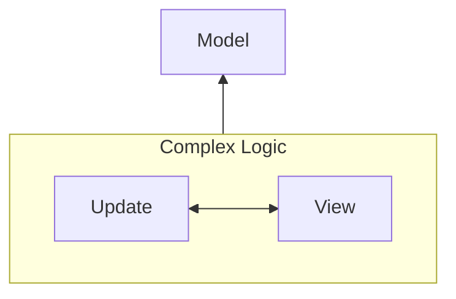
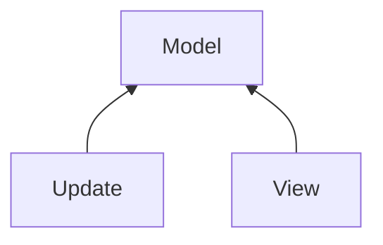
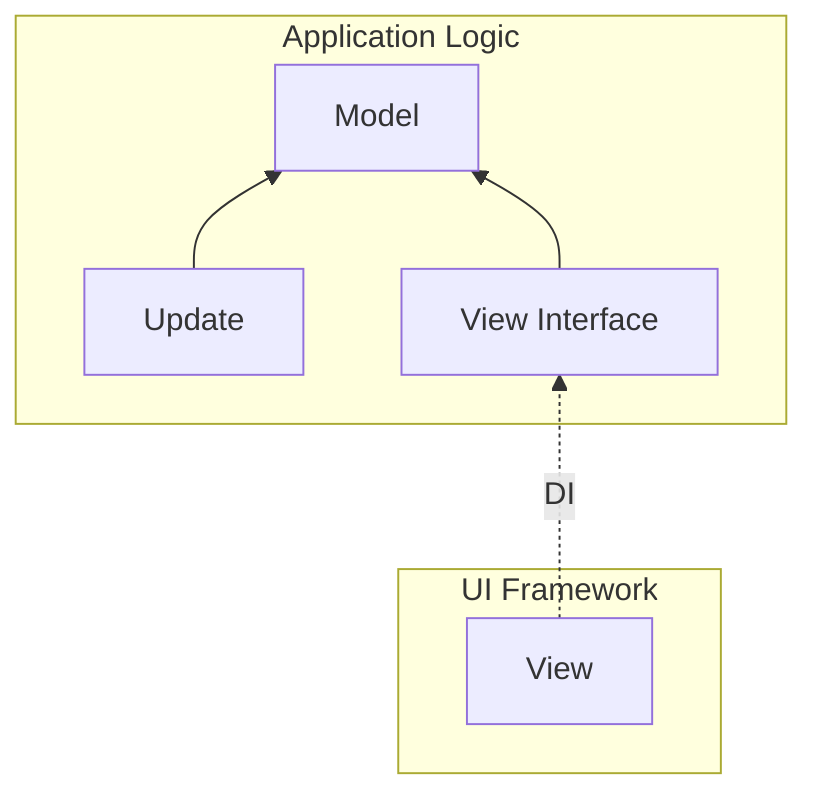

# @ichi-h/elmish

[](./LICENSE) [](https://www.npmjs.com/package/@ichi-h/elmish)

日本語版は[こちら](./README.ja.md)

@ichi-h/elmish is a library for state management without depending on UI frameworks or UI libraries while keeping the Elm Architecture interface as much as possible.

## WARNING

**THIS LIBRARY IS HIGHLY EXPERIMENTAL AS IT IS DESIGNED FOR HYPOTHESIS TESTING PURPOSES. ITS USE IN A PRODUCTION ENVIRONMENT IS STRONGLY DISCOURAGED.**

## Usage

### Install

```bash
npm install @ichi-h/elmish
```

### Define renderer

Define a function that renders the element returned by the View function to the browser.

#### In Vanilla TypeScript

```typescript
export const renderer = (html: HTMLElement) => {
  document.getElementById("app")!.replaceWith(html);
};
```

#### In React

```tsx
import React from "react";
import ReactDOM from "react-dom/client";

const root = ReactDOM.createRoot(document.getElementById("root")!);

export const renderer = (html: React.ReactElement) => {
  root.render(<React.StrictMode>{html}</React.StrictMode>);
};
```

#### In Vue

```typescript
import { VNode, createApp } from "vue";

let app = createApp({});

export const renderer = (html: VNode) => {
  if (app._container) app.unmount();
  app = createApp(html);
  app.mount("#app");
};
```

[#write-logic]: write-logic

### Write logic

```typescript
// data.ts
import { elmish } from "@ichi-h/elmish";

import { renderer } from "./renderer";

// Change the Html type to match the UI library you are using.
// The following is an example using HTMLElement.
type Html = HTMLElement;

export type Model = {
  count: number;
  loader: "idle" | "loading";
};

export type Message =
  | { type: "increment" }
  | { type: "decrement" }
  | { type: "startReset" }
  | { type: "endReset" };

export const init: Model = {
  count: 0,
  loader: "idle",
} as const;

export const { useElement, send } = elmish<Model, Message, Html>(renderer);
```

```typescript
// update.ts
import { Update } from "@ichi-h/elmish";

import { Model, Message } from "./data";

export const update: Update<Model, Message> = (model, message) => {
  switch (message.type) {
    case "increment": {
      return { ...model, count: model.count + 1 };
    }

    case "decrement": {
      return { ...model, count: model.count - 1 };
    }

    case "startReset": {
      return [
        { ...model, loader: "loading" },
        async () => {
          return new Promise((resolve) => {
            setTimeout(() => {
              resolve({ type: "endReset" });
            }, 1000);
          });
        },
      ];
    }

    case "endReset": {
      return { ...model, count: 0, loader: "idle" };
    }
  }
};
```

[#use-in-vanilla-typescript]: use-in-vanilla-typescript

### Use in Vanilla TypeScript

```typescript
import { init, send, useElement } from "./data";
import { update } from "./update";

useElement(init, update, ({ model }) => {
  const app = document.createElement("div");
  app.id = "app";

  const incrementBtn = document.createElement("button");
  incrementBtn.id = "increment";
  incrementBtn.type = "button";
  incrementBtn.innerText = "+";
  incrementBtn.addEventListener("click", () => send({ type: "increment" }));

  const decrementBtn = document.createElement("button");
  decrementBtn.id = "decrement";
  decrementBtn.type = "button";
  decrementBtn.innerText = "-";
  decrementBtn.addEventListener("click", () => send({ type: "decrement" }));

  const resetBtn = document.createElement("button");
  resetBtn.id = "reset";
  resetBtn.type = "button";
  resetBtn.innerText = "reset";
  resetBtn.addEventListener("click", () => send({ type: "startReset" }));

  const counter = document.createElement("p");
  counter.id = "counter";
  counter.classList.add("read-the-docs");
  if (model.loader === "loading") {
    counter.innerText = "loading...";
  } else {
    counter.innerText = `count is ${model.count}`;
  }

  app.appendChild(decrementBtn);
  app.appendChild(resetBtn);
  app.appendChild(incrementBtn);
  app.appendChild(counter);

  return app;
});
```

[#use-in-react]: use-in-react

### Use in React

```tsx
import { init, useElement, send } from "./data";
import { update } from "./update";

useElement(init, update, ({ model }) => {
  const increment = () => send({ type: "increment" });
  const decrement = () => send({ type: "decrement" });
  const reset = () => send({ type: "startReset" });

  return (
    <div>
      <button onClick={decrement}>-</button>
      <button onClick={reset}>reset</button>
      <button onClick={increment}>+</button>
      {model.loader === "loading" && <p>loading...</p>}
      {model.loader === "idle" && <p>count is {model.count}</p>}
    </div>
  );
});
```

[#use-in-vue]: use-in-vue

### Use in Vue

```vue
<script setup lang="ts">
import { Model, send } from "./data";

defineProps<{
  model: Model;
}>();

const msg = "Vite + Vue";

const increment = () => send({ type: "increment" });

const decrement = () => send({ type: "decrement" });

const reset = () => send({ type: "startReset" });
</script>

<template>
  <button type="button" @click="decrement">-</button>
  <button type="button" @click="reset">reset</button>
  <button type="button" @click="increment">+</button>
  <p v-if="model.loader === 'loading'">loading...</p>
  <p v-else-if="model.loader === 'idle'">count is {{ model.count }}</p>
</template>
```

```typescript
import { h } from "vue";

import App from "./App.vue";
import { init, useElement } from "./data";
import { update } from "./update";

useElement(init, update, ({ model }) => h(App, { model }));
```

## What is Elm Architecture?

The Elm Architecture is an architecture for building web applications that uses the Elm language. Elm Architecture is no longer limited to web front-ends, but has been adopted as the architecture for a variety of applications that require interaction, such as desktop apps, mobile apps, and games.

I'm not good enough to explain this, so I quote the documentation for an overview of Elm Architecture.

> 
>
> The Elm program produces HTML to show on screen, and then the computer sends back messages of what is going on. "They clicked a button!"
>
> What happens within the Elm program though? It always breaks into three parts:
>
> - **Model** — the state of your application
> - **View** — a way to turn your state into HTML
> - **Update** — a way to update your state based on messages
>
> These three concepts are the core of **The Elm Architecture**.
>
> \- [The Elm Architecture · An Introduction to Elm](https://guide.elm-lang.org/architecture/)

See [Guide to the Elm Language](https://guide.elm-lang.org/) for more information.

## Purpose of this library

The goal of @ichi-h/elmish is to **validate the pluginization of UI libraries through view dependency inversion**.

Declarative UI is, simply put, **a concept that automatically updates the UI when the state is updated, without having to think about procedural operations such as touching the DOM**. This concept is based on the fact that **the logic to update the state can be separated from the logic to update the UI**.

In other words, the dependencies are not like this,



but are as follows.



The dependencies of Model, View and Update in Elm Architecture are exactly in the above form.

By the way, if Update and View are not dependent on each other, don't you think we could have "Model + Update **and** View"?



In other words, **it should be possible to separate the application logic from the UI framework by solidifying the application logic with Model and Update and injecting entities externally toward the abstracted View.** I verified this hypothesis through @ichi-h/elmish and was able to realize it.

## Drawbacks

Unfortunately, this library has very poor performance because it executes the View function every time the state is updated and re-render all the DOM in the browser. It may be possible to improve the performance somewhat by devising the renderer function, but even then, the performance will not be as good as expected.

## License

@ichi-h/elmish is licensed under the MIT License. See [LICENSE](./LICENSE) for the full license text.
